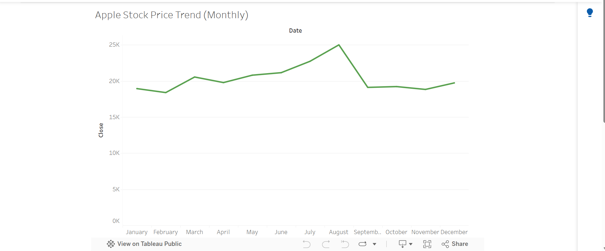

# Financial Dashboard Project

## Project Overview
This project presents a simple financial dashboard built to analyze stock market trends and demonstrate data visualization skills.

## Data Source
The dataset used in this project is publicly available stock market data downloaded from Kaggle.

## Tools Used
Tableau Public was used to build and publish the interactive dashboard.

## Dashboard Screenshot

## Live Dashboard Link
https://public.tableau.com/views/Apple_Stock_Dashboard/Sheet1?:language=en-US&publish=yes&:sid=&:redirect=auth&:display_count=n&:origin=viz_share_link

## Key Insights
- Stock prices show clear trends over time.
- The dashboard allows easy exploration using date filters.

## Assumptions & Limitations
This analysis is based on historical data and does not predict future performance.
